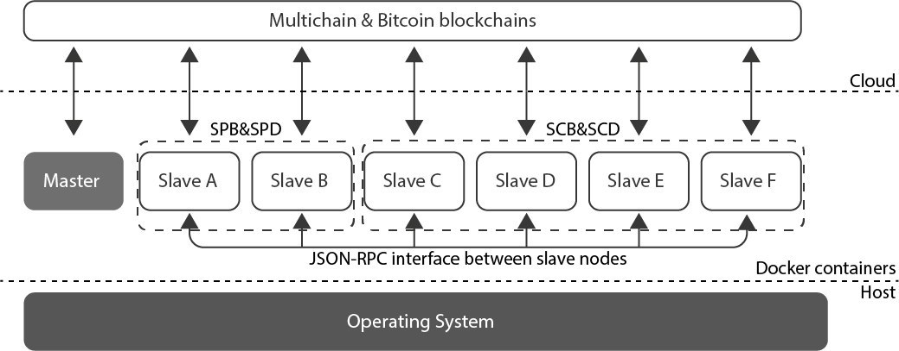

# A blockchain-based Trust System for the IoT

One of the biggest challenges for the Internet of Things (IoT) is to bridge the currently fragmented trust domains. The traditional way to solve this problem, as in the well-known PKI model, has always been via a common root of trust. However, such an approach does not fit well with the extremely heterogeneous  IoT ecosystem, composed by billions of devices, differing in available resources and belonging to independent administrative domains. 

In this work we describe a distributed trust model for the IoT and define a new cryptographic primitive, denoted as obligation chain. Our model leverages the existing trust domains and bridges them to create an end-to-end trust between IoT devices without relying on any common root of trust. Our obligation chain is designed as a credit-based Blockchain with a built-in reputation mechanism. Its innovative design  enables a wide range of use cases and business models that are simply not possible with current Blockchain-based solutions. Furthermore, it does not experience lengthy delays for committing transactions---unlike today's Bitcoin based system. 

## Implementation

The implementation of our solution has been realized by leveraging two blockchain technologies: [Multichain](https://www.multichain.com)  and [Bitcoin core](https://bitcoin.org) . The former is an open source platform that implements the concept of arbitrary digital assets on top of the blockchain. The latter is home to the most famous and widely adopted cryptocurrency used nowadays. More in detail, we used our own regtest bitcoin network for the obligation payments in order to have the transactions locally accepted without the need to pay any real fees.

As regards MultiChain, the technology being used in this paper to implement the concept of obligations, it is an off-the-shelf platform for the creation of private blockchains that proposed a different approach to Bitcoin via integrated management of user permissions that: i) ensures that the blockchain's activity is only visible to chosen participants, ii) introduces controls over which transactions are permitted, and iii) enables mining to take place securely without proof of work and its associated costs. It is however important to highlight that our solution does not depend on any specific technology and can provide the same performance with any other blockchain technology, even those based on proof-of-work (PoW). In fact, as our obligations are accepted locally by the SPs, the block validation process does not affect our performance. As such, the same results and properties shown in this paper might be achieved with [Ethereum](https://www.ethereum.org/) , [IBM Hyperledger Fabric](https://hyperledger.org/projects/fabric) or any other blockchain technology. The same applies for the blockchain being used for payments (i.e. Bitcoin) that could be replaced by [Litecoin](https://litecoin.com) , [RippleCoin](https://ripple.com/) etc.


As per the implementation of the obligation chain and the management of obligations on top of it, we have used a particular feature implemented by the multichain technology, the streams. A stream provides an abstraction from the raw blockchain implementation, thus allowing to focus on general data retrieval, timestamping, and archiving. Indeed, it can be used to implement three different types of databases such as: a) NoSQL key-value databases, b) time series databases, and c) identity-driven databases. In the proof of concept developed and deployed for this work, we have implemented our obligation chain to use streams in the form of key-value databases where service providers' IDs have been used as keys while service consumers' obligations have been used as values. The result obtained with this approach is twofold. First, SCs are able to easily organize and retrieve all the obligations created over time, both fulfilled and not fulfilled, while avoiding the creation of additional databases---thus reducing the storage requirements. Second, SPs are able to easily organize the obligations in fulfilled (i.e. paid by the SC) and pending (i.e. not paid). The result is a better and easier update of SCs' reputations scores.

To deploy our proof of concept environment and to allow service consumers (SCs) and service providers (SPs) in our network to build their own reputation on top of the fulfilled and not fulfilled obligations, we have used two multichain docker images labeled as [master node](https://hub.docker.com/r/kunstmaan/master-multichain/)  and [slave node](https://hub.docker.com/r/kunstmaan/node-multichain/)  both built on top of a basic Ubuntu distribution. The master-node runs the Multichain daemon and boostraps the whole blockchain. This node is the one responsible to give access to other peers to the chain in a permissioned environment. However, as we do not need any identity management, we used the master node only to build and initially configure the chain---but we kept the latter open. Neither the SP and the SC back-ends, nor their end-devices, run within this node. The slave-node implements both end-devices and back-end servers belonging to SCs and SPs. Slave nodes might implement, by default, a [JSON-RPC server](https://www.multichain.com/developers/json-rpc-api/)  to receive information from other nodes. Furthermore, they build a peer-to-peer network used to keep the blockchain synchronized. In our proof of concept, we have used the JSON-RPC interfaces to implement all the communications external to the blockchain. The above two images were then used to instantiate two nodes for the SP (one SPB and one SPD) as well as four different nodes for the SC (one SCB and three SCDs). The result is shown in the figure that follows, where  the six nodes introduced above have been depicted. As represented in the figure, the nodes communicate with each other via a JSON-RPC interface and all of them write/read the two blockchain being used in this solution.

 


### Installing

Uncompress the two images stored into /images, and load them into your machine's local Docker repository.

## Running the code

To use the program, simply run:

```
sudo python main.py
```

## Built With

* [Bitcoin core](https://bitcoin.org/en/download)
* [Multichain](https://www.multichain.com/)


## Authors

* **Roberto Di Pietro** - HBKU-CSE - rdipietro@hbku.edu.qa
* **Xavier Salleras** - UPF - xavier.salleras@upf.edu
* **Matteo Signorini** - Nokia Bell Labs - matteo.signorini@nokia.com
* **Erez Waisbard** - Nokia Bell Labs - erez.waisbard@nokia.com


## License

This project is licensed under GNU GENERAL PUBLIC LICENSE - see the LICENSE file for details


